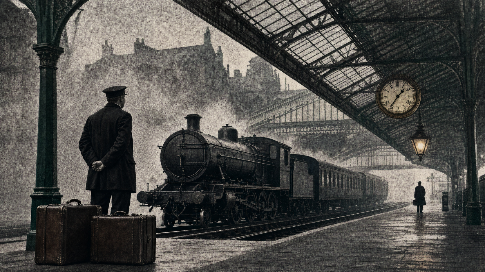

# Old London Editorial Noir

一套为图片与视频提供“老伦敦编辑黑色电影”艺术指导的 Codex Skill。<br>
An installable Codex Skill for Old London editorial-noir image and video art direction.

[中文](#中文) · [English](#english)



由 [@starinzlob](https://github.com/starinzlob) 创建。<br>
Created by [@starinzlob](https://github.com/starinzlob).

## 示例 / Examples

| 主视觉 / Lead image | 视频风格帧 / Video style frame | 商业插画 / Commercial illustration |
| --- | --- | --- |
|  |  |  |
| 竖版 4:5 / Portrait 4:5 | 横版 16:9 / Landscape 16:9 | 方形 1:1 / Square 1:1 |

---

## 中文

Old London Editorial Noir 是一套可安装的 Codex Skill，用于让图片和视频形成统一、克制的老伦敦编辑视觉语言：两次大战之间的英国私人报刊、黑色电影光影、醒目的半色调网点、活版油墨、原始新闻纸、雾、雨、煤气灯，以及现代内容所需的清晰可读性。

它不是给所有内容套上一层棕黄色“复古滤镜”，而是把风格拆成可以执行和检查的制作规则。

### 它能做什么

- 指导静态图片、图像编辑、海报、封面、广告、Logo 和关键帧。
- 指导分镜、动态图形、拼贴 B-roll、片头、完整视频和中英双语字幕。
- 把风格转化为明确的制作契约：叙事、层级、材质、色彩、光线、字体、运动和防跑偏规则。
- 为图片和视频提供独立工作流，并附带确定性的提示词预检脚本。
- 主动拦截泛黄复古、赛博朋克、塑料 3D、蒸汽朋克堆料和宣传徽章式视觉。

### 安装

使用 Codex 自带的 Skill Installer：

```bash
python3 "${CODEX_HOME:-$HOME/.codex}/skills/.system/skill-installer/scripts/install-skill-from-github.py" \
  --repo starinzlob/old-london-editorial-noir \
  --path skills/old-london-editorial-noir
```

安装完成后，这个 Skill 会在下一轮 Codex 对话中生效。

也可以手动安装：

```bash
git clone https://github.com/starinzlob/old-london-editorial-noir.git
mkdir -p "${CODEX_HOME:-$HOME/.codex}/skills"
cp -R old-london-editorial-noir/skills/old-london-editorial-noir \
  "${CODEX_HOME:-$HOME/.codex}/skills/"
```

### 使用

可以显式调用：

```text
使用 $old-london-editorial-noir，把这段文案做成一条克制的
15 秒编辑黑色电影风格视频，并添加中英双语字幕。
```

也可以自然描述需求：

```text
用我们的核心老伦敦报纸风格做一张 4:5 海报。
```

当请求中出现老伦敦、两次大战之间的英国报刊、编辑黑色电影、新闻纸半色调、活版印刷、蚀刻、雾、雨或煤气灯等视觉方向时，这个 Skill 也可以自动触发。

### Skill 结构

```text
skills/old-london-editorial-noir/
├── SKILL.md
├── agents/openai.yaml
├── references/
│   ├── canon.md
│   ├── image-workflow.md
│   └── video-workflow.md
└── scripts/check_style_brief.py
```

### 提示词预检

可以在生成前检查图片提示词：

```bash
python3 skills/old-london-editorial-noir/scripts/check_style_brief.py \
  path/to/prompt.txt --target image
```

将 `--target image` 改成 `--target video`，即可增加运动设计和时间连续性检查。

预检脚本只负责发现可能缺失的风格要素和跑偏风险。最终验收仍然需要查看真实生成结果，检查主体、构图、文字、材质和跨帧一致性。

示例图片由 OpenAI 图像生成工具制作，艺术指导来自本 Skill。示例刻意不把精确文案生成进像素中；正式制作中的标题、字幕和正文应尽量保持可编辑。

### 许可

MIT

---

## English

Old London Editorial Noir is an installable Codex Skill for creating a coherent, restrained visual language across images and videos: interwar British private press, film-noir lighting, visible halftone, letterpress ink, raw newsprint, fog, rain, gaslight, and the clarity required by modern content.

It does not solve the style with a brown “vintage” filter. It turns the visual system into production rules that an agent can execute and check.

### What it does

- Directs still images, image edits, posters, covers, advertisements, logos, and keyframes.
- Directs storyboards, motion graphics, collage B-roll, title sequences, finished videos, and bilingual subtitles.
- Converts the style into a concrete production contract: story, hierarchy, material, palette, light, type, motion, and drift guards.
- Includes separate image and video workflows plus a deterministic prompt preflight script.
- Rejects common drift into generic sepia vintage, cyberpunk, glossy 3D, steampunk clutter, or propaganda-emblem aesthetics.

### Install

Use the Codex Skill Installer:

```bash
python3 "${CODEX_HOME:-$HOME/.codex}/skills/.system/skill-installer/scripts/install-skill-from-github.py" \
  --repo starinzlob/old-london-editorial-noir \
  --path skills/old-london-editorial-noir
```

The Skill will be available on the next Codex turn.

Manual installation:

```bash
git clone https://github.com/starinzlob/old-london-editorial-noir.git
mkdir -p "${CODEX_HOME:-$HOME/.codex}/skills"
cp -R old-london-editorial-noir/skills/old-london-editorial-noir \
  "${CODEX_HOME:-$HOME/.codex}/skills/"
```

### Use

Invoke it explicitly:

```text
Use $old-london-editorial-noir to turn this script into a restrained
15-second editorial-noir video with Chinese and English subtitles.
```

Or ask naturally:

```text
Create a 4:5 poster in our core Old London newspaper style.
```

The Skill can also trigger from requests for interwar London, British newspaper illustration, editorial film noir, halftone newsprint, letterpress, engraving, fog, rain, or gaslight.

### Skill structure

```text
skills/old-london-editorial-noir/
├── SKILL.md
├── agents/openai.yaml
├── references/
│   ├── canon.md
│   ├── image-workflow.md
│   └── video-workflow.md
└── scripts/check_style_brief.py
```

### Prompt preflight

Run an image prompt through the optional preflight:

```bash
python3 skills/old-london-editorial-noir/scripts/check_style_brief.py \
  path/to/prompt.txt --target image
```

Use `--target video` to add motion and temporal-stability checks.

The script identifies missing style anchors and possible drift. Final approval still requires inspecting the generated output for subject clarity, composition, typography, material treatment, and temporal consistency.

The example images were generated with OpenAI image generation using art direction produced from this Skill. Exact copy is intentionally excluded from generated pixels; production titles, subtitles, and body copy should remain editable whenever possible.

### License

MIT
